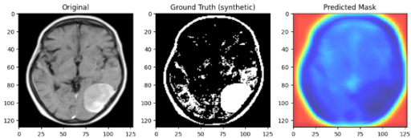

# 🧠 MRI Tumor analysis pipeline

this repository showcases a step-by-step pipeline for **MRI brain tumor analysis**, progressing from simple preprocessing to tumor classification and segmentation
it’s designed as an educational/demo project to help others understand the foundations of medical imaging with AI

---

## 📌 steps in the pipeline

### 🔹 step 1: MRI preprocessing
- load MRI images
- normalize pixel intensities
- apply contrast enhancement and noise reduction
- visualize **original vs preprocessed MRI**
- 
📒 notebook: `mri_preprocessing_demo.ipynb`

---

### 🔹 step 2: tumor detection (classification)
- load MRI slices
- train a simple CNN to **detect whether a tumor is present**
- output a probability score for each image
- visualize predictions

📒 notebook: `notebooks/tumor_detection_demo.ipynb`  
📂 example output: `results/result-step2.png`

---

### 🔹 step 3: tumor segmentation
- move beyond “tumor vs no tumor” to **locating the tumor region**
- built a lightweight **U-Net–style model** for segmentation
- demonstrated with synthetic masks for demo purposes
- visualized **MRI → ground truth → predicted mask**

📒 notebook: `notebooks/tumor_segmentation_demo.ipynb`

---

## 🚀 future work: 3D Segmentation
this repo uses **2D slices** (`.png`) for simplicity
in real-world MRI analysis, tumors are segmented in **3D volumes** using DICOM (`.dcm`) or NIfTI (`.nii`) datasets

to extend this project:
- use libraries like `pydicom` or `nibabel` to load 3D MRI volumes
- replace 2D layers (`Conv2D`, `MaxPooling2D`) with **3D equivalents** (`Conv3D`, `MaxPooling3D`)
- train models like **3D U-Net** or **V-Net**
- visualize in 3D with tools like `itk-snap`, `plotly`, or `mayavi`

---

## ⚙️ installation
1.clone the repo:
git clone https://github.com/Youcef3939/MRI_pipeline.git
cd MRI_preprocessing_pipeline

2.create a virtual environment:
python -m venv venv

source venv/bin/activate   # On Linux/Mac

venv\Scripts\activate      # On Windows

3.install dependencies:

pip install -r requirements.txt

---

## ▶️usage

1. step01-preprocessing: jupyter notebook mri_preprocessing_demo.ipynb

2. tumor detection: jupyter notebook notebooks/tumor_detection_demo.ipynb

3. tumor segmentation: jupyter notebook notebooks/tumor_segmentation_demo.ipynb

---

## 📊 example Results
step1-preprocessing
original vs preprocessed MRI

step2-tumor detection
predicted tumor 

step3-tumor segmentation
original MRI--> synthetic mask--> predicted mask

--- 

## 🙌 Acknowledgements
. open datasets from kaggle and the BraTS challenge

. u-net architecture inspiration from biomedical image segmentation resarch

## 🤝 contributing
This project is a **work in progress** and open to collaboration!  

if you’re interested in:
- adding **new preprocessing techniques**  
- improving the **tumor detection model**  
- extending Step 3 to **real 3D segmentation** using DICOM/NIfTI datasets  
- creating **better visualizations** or **demo outputs**  

…then you’re welcome to contribute!  

### how to contribute:
1. fork the repository.  
2. create a new branch: `git checkout -b feature-name`.  
3. make your changes and commit: `git commit -m "Add feature XYZ"`.  
4. push to your fork: `git push origin feature-name`.  
5. open a pull request — I’ll review it!  

Let’s build a **community-driven MRI tumor analysis pipeline** together 🚀

i'd love your help improving this pipeline!  
