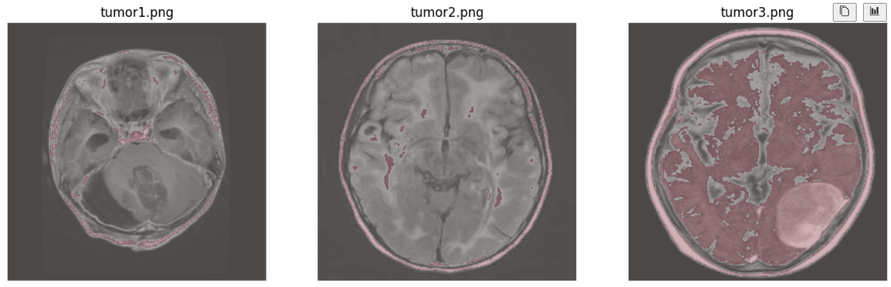

# 🧠 MRI Tumor Analysis Pipeline

This repository showcases a step-by-step pipeline for **MRI brain tumor analysis**, progressing from simple preprocessing to tumor classification and segmentation.  
It’s designed as an educational/demo project to help others understand the foundations of medical imaging with AI.

---

## 📌 Steps in the Pipeline

### 🔹 Step 1: MRI Preprocessing
- Load MRI images.
- Normalize pixel intensities.
- Apply contrast enhancement and noise reduction.
- Visualize **original vs preprocessed MRI**.

📒 Notebook: `mri_preprocessing_demo.ipynb`

---

### 🔹 Step 2: Tumor Detection (Classification)
- Load MRI slices.
- Train a simple CNN to **detect whether a tumor is present**.
- Output a probability score for each image.
- Visualize predictions.

📒 Notebook: `notebooks/tumor_detection_demo.ipynb`  
📂 Example output: `results/result-step2.png`

---

### 🔹 Step 3: Tumor Segmentation
- Move beyond “tumor vs no tumor” to **locating the tumor region**.
- Built a lightweight **U-Net–style model** for segmentation.
- Demonstrated with synthetic masks for demo purposes.
- Visualized **MRI → Ground Truth → Predicted Mask**.

📒 Notebook: `notebooks/tumor_segmentation_demo.ipynb`

---

## 🚀 Future Work: 3D Segmentation
This repo uses **2D slices** (`.png`) for simplicity.  
In real-world MRI analysis, tumors are segmented in **3D volumes** using DICOM (`.dcm`) or NIfTI (`.nii`) datasets.

To extend this project:
- Use libraries like `pydicom` or `nibabel` to load 3D MRI volumes.
- Replace 2D layers (`Conv2D`, `MaxPooling2D`) with **3D equivalents** (`Conv3D`, `MaxPooling3D`).
- Train models like **3D U-Net** or **V-Net**.
- Visualize in 3D with tools like `itk-snap`, `plotly`, or `mayavi`.

---

## ⚙️ Installation
1.clone the repo:
git clone https://github.com/Youcef3939/MRI_preprocessing_pipeline.git
cd MRI_preprocessing_pipeline

2.create a virtual environment:
python -m venv venv
source venv/bin/activate   # On Linux/Mac
venv\Scripts\activate      # On Windows

3.install dependencies:
pip install -r requirements.txt

---

## ▶️usage
1. step01-preprocessing: jupyter notebook mri_preprocessing_demo.ipynb

2. tumor detection: jupyter notebook notebooks/tumor_detection_demo.ipynb

3. tumor segmentation: jupyter notebook notebooks/tumor_segmentation_demo.ipynb

---

## 📊 Example Results
step1-preprocessing
original vs preprocessed MRI

step2-tumor detection
predicted tumor 

step3-tumor segmentation
original MRI--> synthetic mask--> predicted mask

--- 

## 🙌 Acknowledgements
. open datasets from kaggle and the BraTS challenge
. u-net architecture inspiration from biomedical image segmentation resarch

## 🤝 Contributing
This project is a **work in progress** and open to collaboration!  

If you’re interested in:
- Adding **new preprocessing techniques**  
- Improving the **tumor detection model**  
- Extending Step 3 to **real 3D segmentation** using DICOM/NIfTI datasets  
- Creating **better visualizations** or **demo outputs**  

…then you’re welcome to contribute!  

### How to contribute:
1. Fork the repository.  
2. Create a new branch: `git checkout -b feature-name`.  
3. Make your changes and commit: `git commit -m "Add feature XYZ"`.  
4. Push to your fork: `git push origin feature-name`.  
5. Open a Pull Request — I’ll review it!  

Let’s build a **community-driven MRI tumor analysis pipeline** together 🚀

i'd love your help improving this pipeline!  