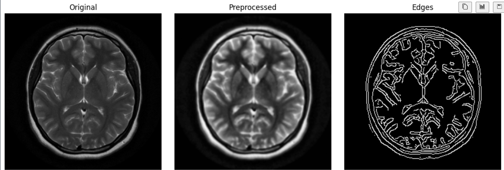

# MRI preprocessing pipeline 🧠

this project demonstrates a simple MRI preprocessing pipeline as a first step towards ai-powered cancer detection.
its part of my work on a project focused on building accessible AI tools for medical imaging.

## features
. loads MRI scans from the 'data/' folder
. converts to greyscale
. normalizes intensity values
. reduces noise using the gaussian filter
. enhances contrast

## exemple output

## tech stack
. python
. numpy
. openCV
. scikit-image
. matplotlib

## how to run?
1. clone the repo:

2. create and activate a virtual environment:
python -m venv venv
.\venv\Scripts\activate   #windows
source venv/bin/activate  #linux/mac

3. install dependencies:
pip install -r requirements.txt

4. open mri_preprocessing_demo.ipynb in vscode and run all cells
N.B: you can use your own MRI images by placing them in the 'data\' folder
here are some sources for sample MRI images:
[scikit-image sample datasets](https://scikit-image.org/docs/stable/auto_examples/data/plot_mri.html)  
- [OpenNeuro](https://openneuro.org/)
- [Kaggle MRI datasets](https://www.kaggle.com/datasets?search=MRI)  

## notes
. the data/ folder should contain sample MRI images(.png,.jpg ,etc)
. the preprocessed images are saved automatically and can be visualized side by side
. this notebook is designed as a starting point for building AI models for medical imaging
